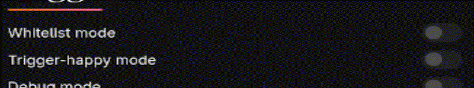
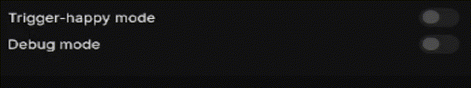

<div style="text-align: center;">
	
</div>

# 🦞Lobster Protect
The Free, Open Source, and silly site blocker

## Table of contents
<!-- no toc -->
- [Introduction and motivations](#Introduction-and-motivations)
- [Installation](#Installation)
- [Future Plans](#Future-plans)
- [Features](#features)
- [Contributing](#contributing)

# Introduction and motivations.

At it's core, LobsterProtect isn't much different than any other site blocker you may find; It does it's job, and it does it well.

But if you have ever _actually_ used a site blocker, you'd know how much paywalling there is, sometimes for features you should be simply **expecting to be there**. Like _merely adding any more than 3 sites to your site list._

```
LobsterProtect — neither the extension itself nor any of it's features — is not, never will and never has been under ANY kind of paywall, and there is no plans to implement any.
This is a passion project, and always will be.
```

### Why?
I fully believe that in the modern day, site blockers are not just tools for parents anymore, but a **requirement** for browsing the Web both safely and productively; To me, it's almost shocking that they don't come packaged in browsers by default.

# Installation

1. ### Through the Chrome Web Store
You can install LobsterProtect from the [Chrome Web Store](https://chromewebstore.google.com/search/LobsterProtect).

Do note however, not all updates will be pushed to the Chrome Web Store version of LobsterProtect, this is because Chrome Extensions need to be reviewed by Google itself before they're updated/uploaded.

So if an update is "small and meaningless enough" then it won't be implemented in the Chrome Web Store version until an update that *isn't small and meaningless* is released.

#### What isn't small and meaningless?
- Major bugfixes 
  - In regards to the actual site blocker functionality. E.g. Some sites not being blocked or unexpected false positives.
  - Any issues that were flagged as "High priority".
  - In regards to Accessibility.
  - In regards to Security.
- Any bump to the MAJOR or MINOR versions.
  - In semantic versioning, [[MAJOR].[MINOR].[PATCH]](https://semver.org/#summary).
    - New features.
    - Breaking changes.
    - QoL.
    - ...

2. ### From this very repository

Alternatively, you can "build from source" by cloning this repository somewhere in your system, and loading it unpacked in your supported browser. For a tutorial on how to do this, check out this video:

<video controls src="resources/loadUnpackedTutorial.mp4" title="Load Unpacked Tutorial"></video>

# Future plans

This is more of an informative section that aims to answer questions before they're asked.

- ### Why so few features?
    - v1.0 was released in this state because most of the upcoming features will likely not be used by most people, and since a lot of those features are still a WIP, i didn't want to delay the release over features that people (probably) won't use or care about. But there is more features coming!
- ### When will this come to firefox/safari/any_browser_im_forgetting?
	- Probably soon! I can't say for sure when, but what i *can* say for sure is that v1.0 will not be ported to other browsers. There's plenty of features i haven't implemented into the base extension yet, so i still need to test them before i can even *consider* porting the project.
	- I really don't want to worry about portability more than maintainability, so until the codebase is in a state i'm more comfortable with, it will not come to any other browsers.

# Features

LobsterProtect offers what you'd expect from your average site blocker, this section is about getting into details about the functionality and implementation of these features.

- ## Globals

One of the features i have in mind for the future is making each Sitelist entry capable of overriding the Global settings, so some sites can be treated specially;\
However, this isn't implemented yet so calling this section "Globals" is a little pointless since nothing can override it. But regardless, these options define LobsterProtect's behavior as a whole.

### Trigger options

Here's where you tell LobsterProtect what to do when it detects you are in a forbidden site.

#### `Action`

Currently there's only 3 possible "Actions" available, all of which have self descriptive names.
- Close the browser.
- Close the tab.
- Redirect to another site.

#### `Redirect URL`

Determines where will you be redirected to when `Action` is "Redirect to another site"

> [!WARNING]
> Careful when using "Redirect to another site" _(especially when using it alongside [Whitelist mode](#whitelist-mode))_.\
> **Make sure the Redirect URL is not going to trigger LobsterProtect as well**, otherwise any trigger to LobsterProtect will lock you in a redirection loop since the very site it's redirecting you to will trigger a redirect as well.
>
> This won't break anything, but it will be pretty annoying though.

- ## Toggles

Simple Booleans that alter the functionality of LobsterProtect.

### `Whitelist mode`


As the name implies, all this feature does is turn your sitelist into a whitelist, essentially inverting the functionality of LobsterProtect; **If you're _somewhere_ the list hasn't approved of, then you're _somewhere_ you shouldn't be in.**

### `Trigger-happy mode`



This one is a little hard to explain, but if you know javascript this should work:
<details>
<summary>For the nerds</summary>

```js
// NOT ACTUAL IMPLEMENTATION

// Trigger Happy
if (current_site.includes(sitelist_entry)) {
	onTrigger();
}

// Default behavior
if (current_site === sitelist_entry) {
	onTrigger();
}
```

</details>

#### If you don't know javascript;

By default, an entry in your sitelist won't trigger LobsterProtect against your current site **unless it explicitly is your site's hostname**.

This comes with the downside of sitelist entries having to be explicit [`hostname`](https://developer.mozilla.org/en-US/docs/Web/API/Location#location_anatomy)s — which might be what you want! — But it might end up causing unexpected non-triggers if you don't actually know the [`hostname`](https://developer.mozilla.org/en-US/docs/Web/API/Location#location_anatomy) beforehand.

To illustrate, a sitelist entry named `google.com` won't trigger LobsterProtect on [Google](https://www.google.com/) because its [`hostname`](https://developer.mozilla.org/en-US/docs/Web/API/Location#location_anatomy) is `www.google.com`, not `google.com`;\
In this situation, `Trigger-happy mode` being enabled would've made this entry actually work as expected.

> [!NOTE]
> You can block more than one site with only one entry since it just uses [`String.prototype.includes()`](https://developer.mozilla.org/en-US/docs/Web/JavaScript/Reference/Global_Objects/String/includes#examples), however, be careful around false positives.
>
> An entry named `red`, will indeed block `www.reddit.com`, but it will also block `www.red.com`, `www.redhat.com`, `www.simplyred.com` and so on, so be mindful of this.

> [!TIP]
> A great way to use this feature is with pages that have different [`hostname`](https://developer.mozilla.org/en-US/docs/Web/API/Location#location_anatomy)s depending on the language they're hosted in, for example, `wikipedia` will block `uk.wikipedia.com`, `en.wikipedia.com`, `es.wikipedia.com` and so on.


### `Debug mode`


For debugging purposes, all it does is print to the devTools console more often. Essentially making LobsterProtect more of a yapper.

*If you're reporting a bug, turning this on and sending a screenshot of the devTools console when the bug happens would be greatly appreciated.*

# Contributing

First of all, from the bottom of my heart, thank you for expressing interest in contributing ❤️

This section is here just to link you to both important documents you need to read if you wish to contribute in any capacity.

## What counts as "contributing"?
Any action of which its ultimate intent would be to make the project better in some capacity; Bug reporting, Feature requests, Source code contributions, and such.

If you're doing something with the *intent* of helping the project, you're contributing.

Here's some basic guidelines:

- ### For ALL Contributions
Please read the [Code of Conduct](), it's not a long read and it'd help me maintain the project and the sanity of everyone else that wishes to contribute.

- ### For Source Code Contributions
Make sure you read [CONTRIBUTING.md](CONTRIBUTING.md), you'll find all the useful information there, such as what is the formatting tool standard and how to write your commit messages.

- ### For Bug Report Contributions
Keep it clear and concise, provide as many details as you can, and explain if you managed to reproduce that bug; If you're asked for more details, explain why if you can't, provide if you can.

You don't need to keep it formal or add fancy words, just make sure your points go across!

## Happy safe browsing 💖🦞
[](LICENSE.txt)